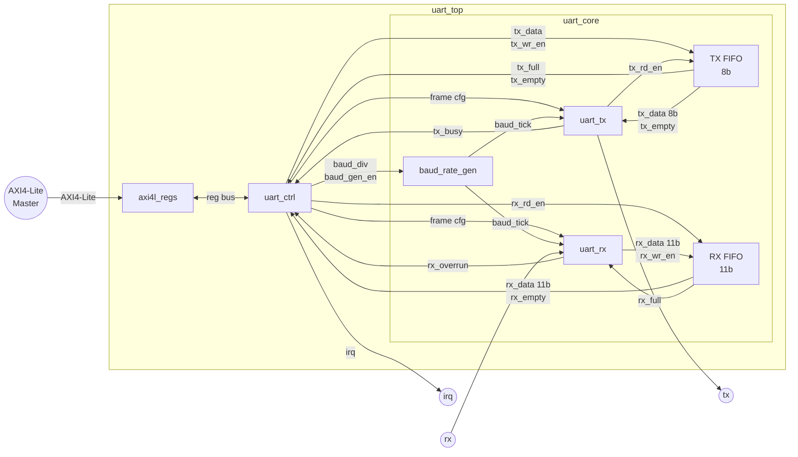

# AXI4-Lite UART Design

## Architecture

The design is split into three levels:

- `uart_top` -- AXI4-Lite register interface + `uart_ctrl` + `uart_core`
- `uart_core` -- datapath: `baud_rate_gen`, `uart_tx`, `uart_rx`, TX FIFO, RX FIFO
- Individual RTL modules verified bottom-up before integration

The FIFOs live inside `uart_core` but are external to `uart_tx` and `uart_rx`.



---

## Software

The UART is intended for use in a Zynq design running Linux on the PS. The PL
UART is accessed by the PS via memory-mapped AXI4-Lite registers. The Linux
driver registers as a tty device using the serial core framework
(`drivers/tty/serial/serial_core.c`).

Driver source will live in the Arty-Z7 repository, not this one.

### Device Tree Requirements

The driver requires the following properties in the device tree node:

- `reg` -- base address and size of the AXI4-Lite register window
- `clocks` / `clock-frequency` -- peripheral clock frequency; used to compute
  `baud_div`
- `interrupts` -- interrupt line for TX empty and RX data available events

### Initialization Sequence

1. Read clock frequency from device tree
2. Disable the core (`baud_gen_en = 0`)
3. Configure frame format (`data_bits`, `parity_en`, `parity_odd`, `stop_bits`)
4. Compute and write `baud_div = (f_clk / (baud_rate * 16)) - 1`
5. Enable the core (`baud_gen_en = 1`)
6. Enable interrupts

### Baud Rate Change Procedure

Changing the baud rate requires disabling the core first. `baud_div` is
registered on every clock edge in hardware -- changing it while enabled
produces a corrupted baud tick. The correct sequence is:

1. Disable the core (`baud_gen_en = 0`)
2. Write new `baud_div`
3. Re-enable the core (`baud_gen_en = 1`)

This is satisfied naturally by the serial core framework since `set_termios`
is only called when the port is quiescent.

### Frame Configuration

`data_bits`, `parity_en`, `parity_odd`, and `stop_bits` are written to control
registers and can be changed at any time -- `uart_tx` and `uart_rx` latch these
at the start of each frame. No disable/enable cycle is required. Changes take
effect on the next frame after the write.

### TX Operation

TX is interrupt-driven. The driver implements the `start_tx` callback as
follows:

1. Read bytes from the serial core's circular transmit buffer
2. Write bytes one at a time to the TX data register until the TX FIFO is full
   or the buffer is empty
3. When the TX FIFO drains (TX empty interrupt), repeat from step 1

For `tcdrain()` (wait until all data has left the wire), the driver must wait
until both the TX FIFO is empty AND `tx_busy` is deasserted. TX FIFO empty
alone is not sufficient -- there may still be a byte in the shift register.

### RX Operation

RX is interrupt-driven:

1. Hardware fires an interrupt when the RX FIFO is non-empty
2. The driver reads bytes from the RX data register and checks associated error
   flags for each byte
3. Each byte is pushed to the tty layer via `tty_insert_flip_char()` with the
   appropriate flag

### Error Handling

Received error conditions map directly to Linux tty layer flags:

| Hardware flag     | tty flag       |
|-------------------|----------------|
| `rx_framing_err`  | `TTY_FRAME`    |
| `rx_parity_err`   | `TTY_PARITY`   |
| `rx_overrun`      | `TTY_OVERRUN`  |
| `rx_break`        | `TTY_BREAK`    |

### Interrupt Handling

The UART presents a single interrupt line to the PS interrupt controller. The
driver's ISR reads the Interrupt Status Register (ISR) to determine which
source fired, handles each active source, and clears the handled bits by
writing 1 to the corresponding ISR bits (write-1-to-clear).

| ISR bit           | Action                                              |
|-------------------|-----------------------------------------------------|
| `irq_tx_empty`    | Refill TX FIFO from serial core circular buffer     |
| `irq_rx_not_empty`| Drain RX FIFO, push bytes to tty layer             |
| `irq_rx_error`    | Read and report error byte from RX FIFO to tty layer|

Individual sources are masked via the Interrupt Enable Register (IER). The
driver enables all three sources during `startup` and disables them during
`shutdown`.

### Hardware Assumptions and Requirements

The following constraints are placed on the driver by the hardware design:

- `baud_div` must be written before `baud_gen_en` is asserted on startup
- `baud_gen_en` must be deasserted before changing `baud_div`
- Frame configuration registers may be written at any time
- TX data register writes are dropped if the TX FIFO is full; the driver must
  respect the TX FIFO full status before writing
- RX overrun occurs in hardware when a received byte cannot be written to a
  full RX FIFO; the byte is dropped, `rx_overrun` is pulsed for one cycle,
  and the event is recorded in a status register visible to the driver

---

## axi4l_regs

A generic AXI4-Lite slave. Handles AXI4-Lite handshaking and presents a simple
decoded register bus to the downstream module. Has no knowledge of the register
map or register semantics. Reusable across any IP that implements the register
bus interface.

### Register Bus Interface

This is the interface between `axi4l_regs` and `uart_ctrl`:

```vhdl
reg_addr  : in  unsigned(REG_ADDR_WIDTH-1 downto 0);
reg_wdata : in  std_logic_vector(31 downto 0);
reg_wren  : in  std_logic;
reg_be    : in  std_logic_vector(3 downto 0);
reg_rdata : out std_logic_vector(31 downto 0);
reg_req   : in  std_logic;
reg_ack   : out std_logic;
reg_err   : out std_logic;
```

- `reg_req` is asserted for one cycle to initiate an access
- `reg_ack` and `reg_err` are registered; response arrives one cycle after `reg_req`
- `reg_ack=1, reg_err=0` -- OKAY (maps to AXI4-Lite OKAY response)
- `reg_ack=1, reg_err=1` -- error (maps to AXI4-Lite SLVERR response)
- `reg_err` is only meaningful when `reg_ack` is asserted
- `reg_be` is only meaningful on writes (`reg_wren=1`); `axi4l_regs` drives `1111` on reads
- `reg_rdata` must be valid on the same cycle as `reg_ack`

---

## uart_ctrl

UART-specific control and status logic. Implements the register bus interface
on one side and drives/reads all control and status signals into `uart_core` on
the other. Handles illegal accesses (unmapped addresses, RO write violations)
and generates the single interrupt output for the driver.

### Interrupts

Three interrupt sources feed into `uart_ctrl` from `uart_core`:

| Source            | Condition                        |
|-------------------|----------------------------------|
| `irq_tx_empty`    | TX FIFO became empty             |
| `irq_rx_not_empty`| RX FIFO is not empty             |
| `irq_rx_error`    | RX error flag set in RX FIFO entry (framing, parity, or break), or `rx_overrun` pulsed |

`uart_ctrl` implements two interrupt registers:

- **Interrupt Enable Register (IER)** -- one bit per source; gates whether a
  source contributes to the interrupt output
- **Interrupt Status Register (ISR)** -- one bit per source; set when the
  condition occurs, cleared by writing 1 to the bit (write-1-to-clear)

The single `irq` output is the OR of all `(ISR & IER)` bits. The PS interrupt
controller receives this line.

Register map: TBD.

---

## uart_core

Datapath wrapper. Instantiates `baud_rate_gen`, `uart_tx`, `uart_rx`, and the
TX and RX FIFOs. External interface presents control and status signals to
`uart_ctrl` on one side and the serial TX/RX lines on the other.

### Open Items

- **Software reset** -- a register-writable bit in `uart_ctrl` that asserts
  `rst` to `uart_core`, allowing software to reset the entire datapath without
  a hardware reset. To be defined during `uart_core` requirements.
- **Loopback mode** -- a register-writable bit that muxes the `tx` output of
  `uart_tx` back to the `rx` input of `uart_rx`, bypassing the external serial
  lines. To be defined during `uart_core` requirements.

---

## baud_rate_gen

Status: signed off. All 7 unit tests pass.

Generates a one-clock-wide `baud_tick` at 16x the configured baud rate. A
single instance is shared by `uart_tx` and `uart_rx`. `uart_tx` counts 16
ticks per bit internally. `uart_rx` uses the tick directly for oversampling.

`baud_gen_en` is a global software enable driven from a control register. It
is not a per-frame signal. The generator runs continuously while asserted.

`baud_div` is driven from a software register and must be stable before
`baud_gen_en` is asserted. In practice this is always satisfied since multiple
AXI transactions separate the two writes.

Divisor formula: `baud_div = (f_clk / (baud_rate * 16)) - 1`

`baud_div` is not latched at a safe point -- it is registered on every clock
edge. Changing it while the core is enabled will produce a corrupted baud tick.
Software must disable the core (deassert `baud_gen_en`) before changing
`baud_div`. This is enforced by convention, not hardware. The Linux serial
driver satisfies this naturally since `set_termios` is only called when the
port is quiescent.

### Requirements

- **BRG-001** -- While `baud_gen_en` is deasserted, `baud_tick` shall be 0 and `baud_cnt` shall be 0.
- **BRG-002** -- When `baud_gen_en` is asserted, the first `baud_tick` shall fire after `baud_div + 1` clock cycles. The value in effect is the `baud_div` presented on the cycle immediately before `baud_gen_en` is asserted, due to one-cycle internal registration.
- **BRG-003** -- Each `baud_tick` pulse shall be exactly one clock cycle wide.
- **BRG-004** -- In steady state, `baud_tick` shall fire with a period of exactly `baud_div + 1` clock cycles.
- **BRG-005** -- When `baud_div = 0`, `baud_tick` shall fire on every clock cycle while `baud_gen_en` is asserted.
- **BRG-006** -- Deasserting `baud_gen_en` shall suppress `baud_tick` and reset `baud_cnt` to 0 on the next clock edge.
- **BRG-007** -- A synchronous reset shall clear `baud_tick` to 0 and `baud_cnt` to 0, regardless of `baud_gen_en`.

---

## uart_tx

Serializes bytes from the TX FIFO onto the `tx` line, one frame at a time,
using `baud_tick` to advance the bit counter. Counts 16 ticks per bit to
align with the 16x oversample tick from `baud_rate_gen`.

### Interface

```vhdl
clk        : in  std_logic;
rst        : in  std_logic;

-- from baud_rate_gen
baud_tick  : in  std_logic;

-- frame configuration (driven from control registers via uart_ctrl)
data_bits  : in  unsigned(1 downto 0);   -- 00=5, 01=6, 10=7, 11=8
parity_en  : in  std_logic;
parity_odd : in  std_logic;              -- 0=even, 1=odd; ignored when parity_en=0
stop_bits  : in  std_logic;              -- 0=1 stop bit, 1=2 stop bits

-- TX FIFO read port
tx_data    : in  std_logic_vector(7 downto 0);
tx_empty   : in  std_logic;
tx_rd_en   : out std_logic;

-- serial output
tx         : out std_logic;

-- status
tx_busy        : out std_logic;

-- diagnostic counters
tx_frame_count : out unsigned(31 downto 0)
```

`tx_busy` is asserted whenever the serializer is actively shifting out a frame.
It remains asserted until the stop bit has been sent. Used by `uart_ctrl` to
distinguish TX FIFO empty (ready to accept more data) from line truly idle
(FIFO empty and shift register done). Required for correct `tcdrain()`
behavior in the Linux serial driver.

Frame configuration inputs are registered internally at the start of each
frame, so changes mid-frame do not affect the frame in progress. The new
configuration takes effect on the next frame.

### Open Questions

- FIFO mode: FWFT or standard read latency? Deferred to TX+FIFO integration.

### Requirements

- **UTX-001** -- While idle (no frame in progress), `tx` shall be 1 and `tx_busy` shall be 0.
- **UTX-002** -- Frame configuration (`data_bits`, `parity_en`, `parity_odd`, `stop_bits`) shall be latched at the start of each frame. Changes mid-frame do not affect the frame in progress; the new configuration takes effect on the next frame.
- **UTX-003** -- When idle and `tx_empty` is deasserted, a new frame shall begin on the next `baud_tick`.
- **UTX-004** -- A frame shall begin with a start bit: `tx = 0` held for 16 consecutive `baud_tick` pulses.
- **UTX-005** -- Data bits shall be transmitted LSB-first, one bit per 16 `baud_tick` pulses. The number of data bits is determined by `data_bits`: `00`=5, `01`=6, `10`=7, `11`=8.
- **UTX-006** -- When `parity_en = 1`, a parity bit shall be transmitted after the last data bit, held for 16 `baud_tick` pulses. When `parity_odd = 0`, even parity is used; when `parity_odd = 1`, odd parity is used.
- **UTX-007** -- A stop bit (`tx = 1`) shall be transmitted after the last data or parity bit, held for 16 `baud_tick` pulses per stop bit. When `stop_bits = 0`, one stop bit is sent; when `stop_bits = 1`, two stop bits are sent.
- **UTX-008** -- `tx_busy` shall be asserted from the start of the start bit through the end of the last stop bit. It shall deassert on the clock cycle following the last stop bit tick.
- **UTX-009** -- When a frame completes and `tx_empty` is deasserted, the next frame shall begin on the immediately following `baud_tick`, with no idle cycle inserted between frames.
- **UTX-010** -- `tx_rd_en` shall not be asserted while `tx_empty` is asserted. Exact `tx_rd_en` assertion timing is deferred to TX+FIFO integration and depends on FIFO read mode (FWFT vs standard).
- **UTX-011** -- A synchronous reset shall set `tx` to 1, `tx_busy` to 0, and `tx_rd_en` to 0.
- **UTX-012** -- `uart_tx` shall maintain a 32-bit transmit frame count (`tx_frame_count`) that increments by 1 on the clock cycle that `tx_busy` deasserts after each transmitted frame. The counter wraps on overflow and resets to 0 on synchronous reset.

---

## FIFOs

Both FIFOs are `uart_sync_fifo` instances wrapping Xilinx FIFO primitives.
They live inside `uart_core`, external to `uart_tx` and `uart_rx`.

| FIFO    | Width   | Notes                                                        |
|---------|---------|--------------------------------------------------------------|
| TX FIFO | 8 bits  | data only                                                    |
| RX FIFO | 11 bits | [10]=break, [9]=parity_err, [8]=framing_err, [7:0]=data      |

Bundling error flags with RX data in the FIFO preserves per-byte error
association, which is required for correct use of `tty_insert_flip_char()` in
the Linux driver. Overrun is not a per-byte flag and is not stored in the FIFO;
it is reported via a separate `rx_overrun` strobe from `uart_rx` to `uart_ctrl`.

FIFO depth: TBD.

---

## uart_rx

Deserializes frames from the `rx` line into the RX FIFO using 16x oversampling
for mid-bit sampling and start bit validation.

### Interface

```vhdl
clk        : in  std_logic;
rst        : in  std_logic;

-- from baud_rate_gen
baud_tick  : in  std_logic;

-- frame configuration (driven from control registers via uart_ctrl)
data_bits  : in  unsigned(1 downto 0);   -- 00=5, 01=6, 10=7, 11=8
parity_en  : in  std_logic;
parity_odd : in  std_logic;              -- 0=even, 1=odd; ignored when parity_en=0
stop_bits  : in  std_logic;              -- 0=1 stop bit, 1=2 stop bits

-- serial input
rx         : in  std_logic;

-- RX FIFO write port
-- rx_data bit packing: [10]=break, [9]=parity_err, [8]=framing_err, [7:0]=data
rx_data    : out std_logic_vector(10 downto 0);
rx_wr_en   : out std_logic;
rx_full    : in  std_logic;

-- overrun strobe and diagnostic counters
rx_overrun     : out std_logic;
rx_frame_count : out unsigned(31 downto 0);
rx_drop_count  : out unsigned(31 downto 0)
```

Frame configuration inputs are registered internally at the start of each
frame, same as `uart_tx`.

### Start Bit Detection

`uart_rx` watches for a falling edge on `rx`. On detecting the edge it waits
until oversample tick 8 (the middle of the start bit) and re-samples. If `rx`
is still low the start bit is valid and frame reception begins. If `rx` has
returned high the edge was a glitch and the receiver returns to idle. This
prevents noise spikes from triggering spurious frames.

### Sampling

Each bit is sampled at oversample tick 8 (mid-bit). The 16x `baud_tick` from
`baud_rate_gen` is used directly -- no internal tick generation.

### Error Recovery

- **Parity error** -- frame timing was intact. The parity error flag is set in
  the FIFO word, the byte is written to the FIFO, and the receiver immediately
  returns to hunting for the next start bit.
- **Overrun** -- the RX FIFO was full when the byte was ready. The byte is
  discarded, `rx_overrun` is pulsed for one cycle, and the receiver immediately
  returns to hunting for the next start bit.
- **Framing error / break** -- the stop bit was 0, so the line is still low.
  The receiver waits for `rx` to return high before resuming start bit hunting.
  Jumping straight to the next start bit would produce incorrect frame timing.

Overrun is detected when `rx_full` is asserted at the moment a new byte is
ready to write. The byte is dropped and `rx_overrun` is pulsed for one cycle.

### Requirements

- **URX-001** -- The `rx` input shall be synchronised to the system clock using a two-register (2-FF) synchroniser before any processing. All internal logic operates on the synchronised signal.
- **URX-002** -- While idle, the receiver shall monitor the synchronised `rx` line for a falling edge to detect the start of a start bit.
- **URX-003** -- On detecting a falling edge on `rx`, the receiver shall reset its oversample counter and wait until the 8th subsequent `baud_tick`. If `rx` is still 0 at tick 8, the start bit is valid and frame reception begins. If `rx` has returned to 1, the edge is a glitch and the receiver returns to idle.
- **URX-004** -- Frame configuration (`data_bits`, `parity_en`, `parity_odd`, `stop_bits`) shall be latched when a valid start bit is confirmed. Changes mid-frame do not affect the frame in progress.
- **URX-005** -- Each data bit shall be sampled at tick 8 of its 16-tick oversample window, LSB-first. The number of data bits is determined by `data_bits`: `00`=5, `01`=6, `10`=7, `11`=8.
- **URX-006** -- When `parity_en = 1`, the parity bit shall be sampled at tick 8 of the parity window. A mismatch against the expected parity shall set `rx_data[9]` (parity_err).
- **URX-007** -- The stop bit shall be sampled at tick 8 of the stop bit window. If the stop bit is 0, `rx_data[8]` (framing_err) shall be set.
- **URX-008** -- A break is distinguished from a framing error as follows: if the stop bit is 0 and all data bits are 0 and the parity bit (if enabled) is 0, the condition is a break (`rx_data[10]` set); if the stop bit is 0 and any other received bit is 1, it is a framing error (`rx_data[8]` set, `rx_data[10]` clear).
- **URX-009** -- When `rx_full` is asserted at the moment a received frame is ready to write, the byte shall be discarded: `rx_wr_en` shall not be asserted and `rx_overrun` shall be pulsed for exactly one clock cycle.
- **URX-010** -- On a successfully received byte, `rx_wr_en` shall be asserted for one clock cycle with `rx_data` valid. `rx_data[7:0]` contains the received byte; `rx_data[10:8]` contains error flags from the frame.
- **URX-011** -- On a parity error or overrun, the receiver shall return to idle immediately after the frame completes, without waiting for `rx` to return high.
- **URX-012** -- On a framing error or break, the receiver shall wait for `rx` to return to 1 before resuming start bit detection.
- **URX-013** -- A synchronous reset shall return the receiver to idle with `rx_wr_en` and `rx_overrun` both 0.
- **URX-014** -- `uart_rx` shall maintain a 32-bit received frame count (`rx_frame_count`) that increments by 1 each time a complete, error-free frame is successfully written to the FIFO (`rx_wr_en` asserted with `rx_data[10:8]` all zero). Dropped frames, errored frames, and glitch-rejected starts shall not increment this counter. The counter wraps on overflow and resets to 0 on synchronous reset.
- **URX-015** -- `uart_rx` shall maintain a 32-bit dropped frame count (`rx_drop_count`) that increments by 1 each time a complete, error-free frame is discarded because `rx_full` is asserted when the byte is ready. Errored frames and glitch-rejected starts shall not increment this counter. The counter wraps on overflow and resets to 0 on synchronous reset.

